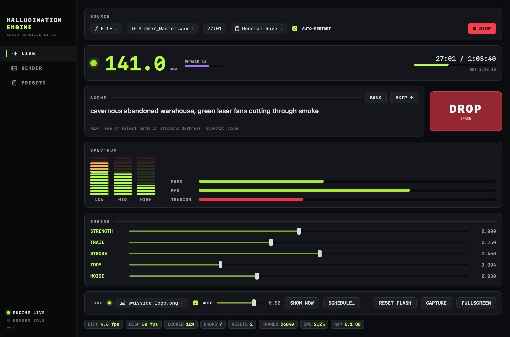
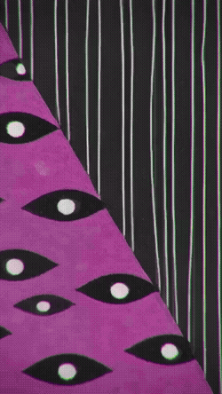
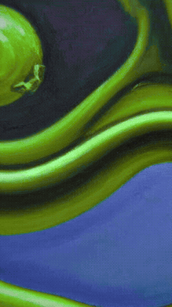
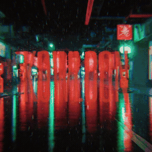
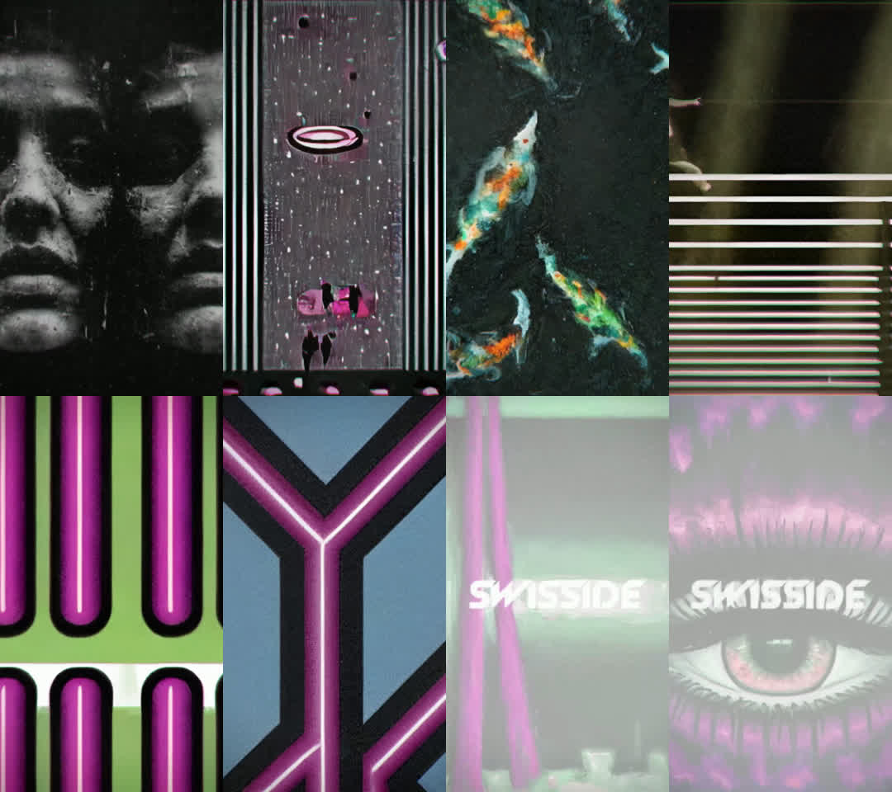
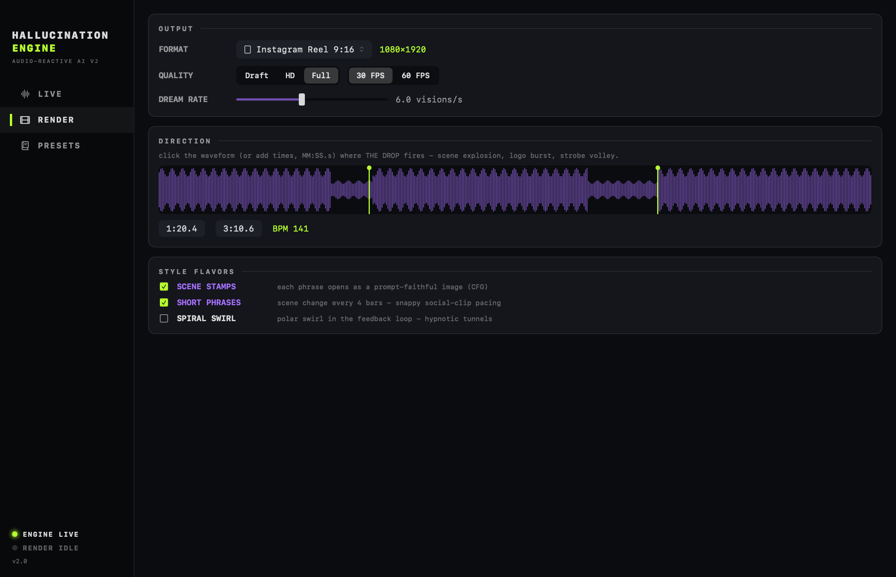
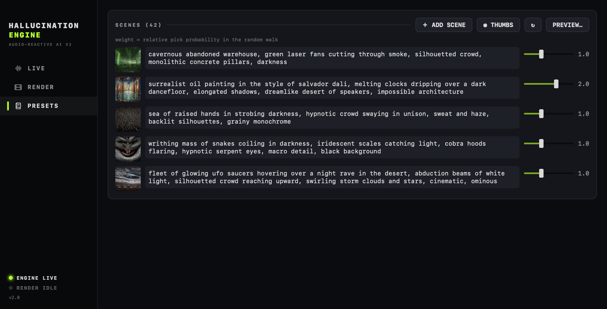
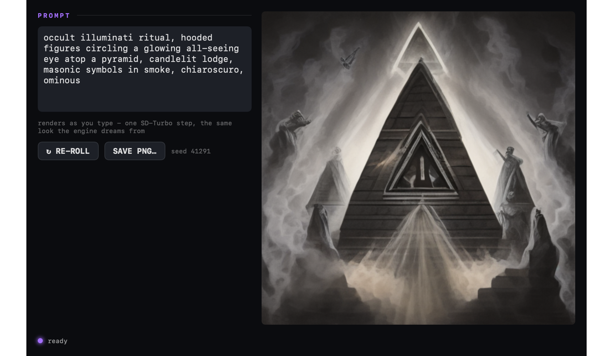

# Hallucination Engine

A realtime audio-reactive AI VJ for Apple Silicon Macs. It listens to music,
finds the kicks, the buildups and the drops, and drives a Stable Diffusion
feedback loop that dreams club visuals in sync with the track. Run it live
behind a DJ set, or render social-ready videos offline with drops cued to
the exact second.



The pipeline has three layers:

- **Audio brain** (~86 Hz): FFT band energies, adaptive normalizers, kick
  and big-onset detection, BPM and beat phase tracking, buildup tension and
  drop detection. Kicks are gated on transientness (band flux vs magnitude),
  so a kickless breakdown carried by a bassline still banks tension for the
  drop. A separate flux detector marks synth entrances: when a lead arrives,
  the conditioning lunges toward the next scene and the compositor fires a
  random one-shot (hue jolt, chroma bloom or trail flush).
- **Hallucination loop** (~4.5 fps at 512px on an M4 Pro): an SD-Turbo
  img2img feedback loop. Every output frame becomes the next input; the
  audio modulates denoise strength, noise injection, zoom, rotation and
  prompt-embedding interpolation. One UNet step per frame, TAESD for
  decoding, everything resident on the GPU.
- **Beat compositor** (locked 60 fps GLSL): crossfades the diffusion frames
  and adds the instant-feel layer: kick pulse, chromatic aberration,
  trails, strobes, hue drift.

The point of the split is that the slow dreaming layer never has to carry
the beat. Even at 4 fps of diffusion the picture hits on every kick,
because the 60 fps layer reacts instantly while the dream morphs
underneath.

## Photosensitivity warning

This program produces flashing imagery, including strobes synced to music.
If you or anyone nearby is photosensitive, set `enable_strobe: false` in
`config.yaml` before running.

## What it looks like

Rendered from real tracks, one diffusion step per frame, no cherry-picked
upscaling. The wordmark burned into some frames is the logo feature doing
its thing on drops.

| The drop | Feedback dreaming | Square format |
|---|---|---|
|  |  |  |



## Requirements

- Apple Silicon Mac. Development happens on an M4 Pro; anything M1-or-later
  should work with lower frame rates.
- macOS 14 or later for the control app.
- Python 3.13 exactly (torch wheel availability; 3.14 has no wheels yet).
- ffmpeg for offline renders: `brew install ffmpeg`.
- About 3 GB of disk for models on first run.

## Install

```bash
git clone https://github.com/swisside999/hallucination-engine
cd hallucination-engine
python3.13 -m venv .venv
source .venv/bin/activate
pip install -r requirements.txt
```

The first run downloads `stabilityai/sd-turbo` and TAESD from Hugging Face
and exports them to `./models/`. Every later start loads locally and never
touches the network. This matters more than it sounds: Hub metadata checks
can hang for minutes on flaky venue wifi, which is exactly where this
software runs.

## Quick start

```bash
python main.py --file my_techno_mix.wav        # --seek 30:00 to jump in
```

That plays the file through your speakers and drives the visuals from the
same samples. Two windows open after warmup: the visual window (clean, no
overlay, fullscreen this one) and a small control window with meters and
sliders. MP3 works if your libsndfile has mp3 support, otherwise convert
with ffmpeg first.

For live input (DJ software, a mixer, anything the Mac can hear):

1. `brew install blackhole-2ch`
2. Audio MIDI Setup: create a Multi-Output Device with both your speakers
   and BlackHole 2ch checked, and set it as the system output.
3. `python main.py --device <index>` (`--list-devices` prints the indices),
   or just pick the input by name in the app.
4. Allow the microphone permission prompt on first launch. macOS classes
   every audio input as a microphone, BlackHole included; without the grant
   the engine reads silent zeros and the spectrum stays flat.

Live input is club-hardened: a flatlined or dead stream (cable bump,
interface hiccup) is detected within seconds and reopened, re-resolving the
device by name since indices shift when hardware re-enumerates. The app
shows an INPUT SILENT banner and a CLIP indicator for hot booth levels,
holds the Mac awake while the engine runs, and a watchdog restarts a hung
engine after 10 s of frozen stats. An output tone curve (black level,
contrast, saturation) lives in the LED OUT sliders - display-only, it never
enters the feedback loop - for taming a bright LED wall at soundcheck.
`tools/soak_12h.py mix.mp3` runs an overnight soak and reports memory
growth, fps floor and thermal throttling before a long set does.

## The control app

A native SwiftUI cockpit lives in `apps/HallucinationEngine`. No Xcode
project needed:

```bash
./apps/HallucinationEngine/build_app.sh
open "apps/HallucinationEngine/dist/Hallucination Engine.app"
```

It launches the engine headless and talks to it over a localhost JSON
protocol (`hallucination_engine/control_server.py` documents it if you want
to bridge MIDI or OSC).

**Live** is the performance surface: source picker with named audio
inputs, big BPM readout with a beat blinker, a segmented 3-band EQ with
peak hold, scene now/next, live sliders for strength, trail, strobe, zoom
and noise, a scene bank with per-scene weights, and health chips that go
red when the diffusion loop is unhappy. SPACE fires the drop. The logo row
holds a picker, an opacity slider, SHOW NOW, and a wall-clock schedule for
running different logos in different timeslots.

**Render** turns a mix into a video:



- Formats: square 1:1, Instagram Reel 9:16 (1080x1920), YouTube 16:9. The
  reel is center-cropped from a larger square render inside the pipeline,
  one encode, no intermediate files.
- Quality tiers: Draft (512px), HD (1024px), Full (1920px), and Ultra,
  which is Full plus the real SD VAE decoder instead of the realtime tiny
  one and a 20M video bitrate. Ultra is visibly sharper in detail and
  color but renders at roughly 0.2x realtime instead of 0.75x.
- Drop cues: click the waveform where the track actually drops. Each cue
  fires the full drop path: scene explosion, logo burst, strobe volley.
  Cues mute the automatic drop detector, so the video hits exactly where
  the music does. This exists because breakdown sections with sparse kick
  accents defeat any kick-drought heuristic; offline you know the whole
  track, so you may as well say where the drops are.
- Timeline mode: a video-editor style lane view of the whole mix, next to
  the classic AUTO mode. Drop markers auto-detected by a fast audio-only
  analysis pass (then dragged into place by ear, with a playhead and real
  audio playback), scene blocks with explicit order and lengths instead of
  the random walk (click a block to pick its scene from the bank, with
  thumbnails), logo windows, strobe zones, and an intensity curve that
  pushes the dream harder or calmer over time. Edits snap to the detected
  beat grid. Empty lanes keep the automatic behavior. Timelines save per
  mix and survive restarts.
- BPM pin, for tracks where the detector locks onto a neighboring value.
- Logo burn-in with opacity, size, per-drop chance and flash length,
  independent of your live logo settings.
- Style flavors: scene stamps (each phrase opens as a prompt-faithful
  image), short phrases, hybrid two-scene fusions, spiral swirl, and an
  anti-lock boost for dark presets.

Every phrase also gets a random "flavor" tint: a small dose of a second
scene blended into the prompt embedding (`scenes.flavor`, default 0.15),
so the same scene never renders with identical conditioning twice.
- A preview button renders 12 seconds around your first cue at draft
  quality and plays it inline, so you can iterate before committing to the
  full render (~0.75x realtime at 512px, slower at higher sizes).

Everything the tab configures is written as a temp overlay config for that
one render. Your config file and live behavior stay untouched.

CLI equivalents, if you would rather script it:

```bash
python main.py --file mix.wav --render out.mp4 --render-duration 5:00
python main.py --file mix.wav --render reel.mp4 \
    --render-size 1920 --render-crop 1080x1920
python main.py --file mix.wav --analyze cues.json   # drops + BPM, no GPU
```

**Presets** edits the scene banks: prompt text, per-scene weights, the
negative prompt, and the engine overrides a preset carries (strength,
idle noise, saturation target, phrase length, and so on, plus a raw JSON
editor for everything else). Each scene gets a thumbnail, one SD-Turbo
frame of that prompt, generated automatically when you open or save a
preset. Click one for full size.



The **Prompt Preview** window is a live playground: type a prompt and
watch it render as you type, about 0.6 s per frame once the model is
resident. Re-roll seeds until you like what you see, save frames as PNGs,
then paste the prompt into a preset scene.



## Scene presets

Presets are JSON files in `./presets/`, one per kind of event:

```json
{
  "name": "My Party",
  "negative": "watermark, frame, border, bright daylight",
  "scenes": [{"prompt": "...", "weight": 1.5}],
  "config": {"diffusion": {"noise_idle": 0.05}}
}
```

The optional `config` block is deep-merged over `config.yaml` when the
preset loads, so picking a preset also brings the tuning its scenes need.
The built-in 42-scene bank exports itself as "General Rave" on first run.

Presets switch live: pick one in the cockpit while a set is running and
the engine re-encodes the new bank in the background, then crossfades the
conditioning over a few seconds - no restart, no dropped frames. The
preset's config overrides apply live too, and revert cleanly when you
switch again.

Two lessons baked into the shipped presets, learned the hard way: dark
monochrome scene banks need a lower saturation target or the color servo
slowly turns them neon, and brand-color presets must zero the hue rotation
or their reds walk to green within seconds.

## Tuning

`config.yaml` holds every tunable with comments. The three that matter
most:

| Knob | What it does |
|---|---|
| `diffusion.strength_base` | trip intensity: 0.25 frozen, 0.65 dissolving |
| `display.trail_base` | smear amount in the 60 fps layer |
| `scenes.phrase_bars` | bars per scene, 4 is snappy, 8 hypnotic |

Keys in the visual window: SPACE next scene, T tap tempo, arrows adjust
strength, R reset flash, F fullscreen, S saves a frame, ESC quits.

## The hard part: feedback attractors

Any img2img feedback loop collapses if you let it. Left alone it finds a
fixed point, usually stripes, grids or a flat gray field, and stays there.
Most of the engineering in this project is the defense stack:

- a per-frame noise floor so texture never fully dies
- a strong re-dream at every phrase boundary
- FFT orientation detectors that catch stripe and grid locks and trigger
  reset flashes (dot-lattice locks evade them, which is what the anti-lock
  flavor is for)
- a gray-world color servo with luma and saturation bounds
- an unsharp mask with a threshold. The threshold is the difference
  between 15% and 70% of frames locked: without it, sub-perceptual banding
  gets amplified every single frame until the whole image is stripes

A few other things that turned out to matter: the frame must stay fp32 on
the GPU (fp16 transforms accumulate quantization into banding), the loop
must feed back the uint8-quantized frame rather than the float output (the
roundtrip dithers away decode banding), and diffusers' img2img pipeline
quantizes effective strength to 1/steps, so the engine adds noise at an
exact sigma and jumps to x0 in a single UNet call instead.

## Repo layout

```
main.py                      entry point
config.yaml                  every tunable
hallucination_engine/        the python engine
  audio_engine.py            DSP, BPM, tension and drops
  diffusion_engine.py        the GPU-resident feedback loop
  compositor.py              60 fps GLSL layer and windows
  renderer.py                offline renders on a virtual clock
  prompts.py                 scene banks and preset loading
  control_server.py          localhost JSON control protocol
  thumbs.py                  scene thumbnail generator
  prompt_server.py           resident model for the preview window
  shaders/                   the compositor's GLSL
apps/HallucinationEngine/    SwiftUI control app
presets/                     scene banks as JSON
```

## License

MIT. The renders in this README use music by Swisside.
